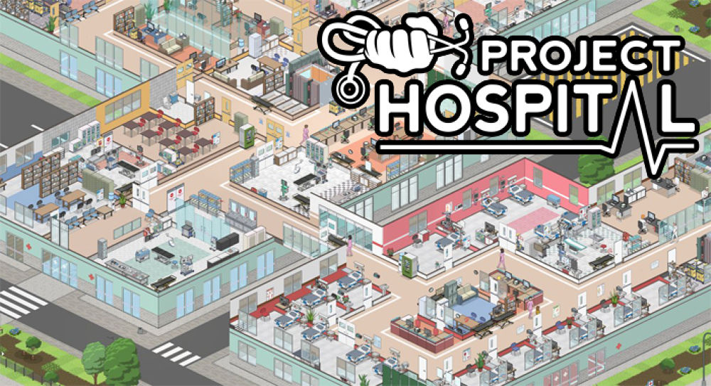

[Project Hospital](https://store.steampowered.com/app/868360/Project_Hospital/) เป็นเกมส์บริหารรพ. ซึ่ง ณ วันที่เขียนยังไม่รองรับภาษาไทย (และคุณ [@chocofah](https://twitter.com/chocofah) อยากเล่น เลยต้องลงให้ แถมไม่มี tutorial ของ MacOS ว่าต้องไปลงที่ไหน เลยต้องรื้อหาเอง และไหน ๆ เจอแล้ว ก็เอามาแชร์ดีกว่า)

---

### สำหรับคนใช้ Windows

มีคนแปลไทยและทำ[วิธีการลงใน Windows](https://www.youtube.com/watch?v=esFj_ciMsV0&t=325s) เอาไว้แล้ว กดตามลิ้งไปเลย

---

## เตรียมพร้อม

1. โหลดเกมส์จาก [Steam](https://store.steampowered.com/app/868360/Project_Hospital/) ก่อน ติดตั้งให้เรียบร้อย (ปกติไม่แจกฟรี ต้องซื้อก่อนน้า)
2. โหลดไฟล์คำแปลภาษาไทยจาก [เว็บนี้](https://www.nexusmods.com/projecthospital/mods/12?tab=files&file_id=30) ถ้ามันบึ้มไปแล้ว โหลดไม่ได้ให้ [โหลดตรงนี้แทน](https://drive.google.com/drive/folders/1BnAft9u2ipkmXx1WpLvNhcdIeo3Ex3wn?usp=sharing)

เราจะได้ไฟล์เป็น `.rar`

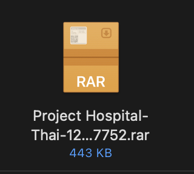

ถ้าเปิดไม่ได้ ให้โหลด [Unarchiever](https://apps.apple.com/th/app/the-unarchiver/id425424353?mt=12) มาแตกไฟล์

แล้วจะได้เป็นโฟลเดอร์แบบนี้

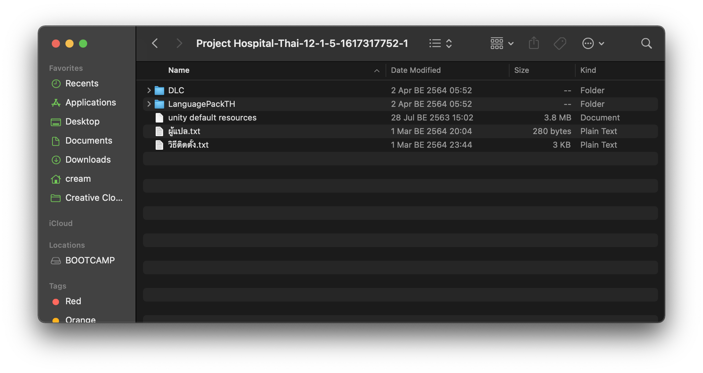

---

## ติดตั้ง

โฟลเดอร์ที่ต้องเข้าไปแก้ต้องใช้ท่าพิเศษเล็กน้อย แต่ไม่ยาก ใช้แค่โปรแกรมที่ติดเครื่องมาตั้งแต่ซื้อเลย ก็คือ Terminal นั่นเอง

### วิธีเปิด Terminal

แบบปกติ

1. เปิด LaunchPad ที่มีโปรแกรมในเครื่องเยอะ ๆ ขึ้นมา มักจะอยู่ในแถบด้านล่างนี่แหละ
   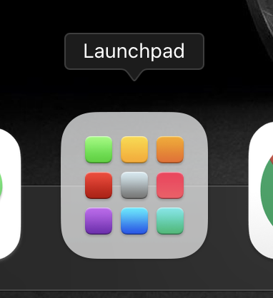
2. search หาคำว่า terminal
   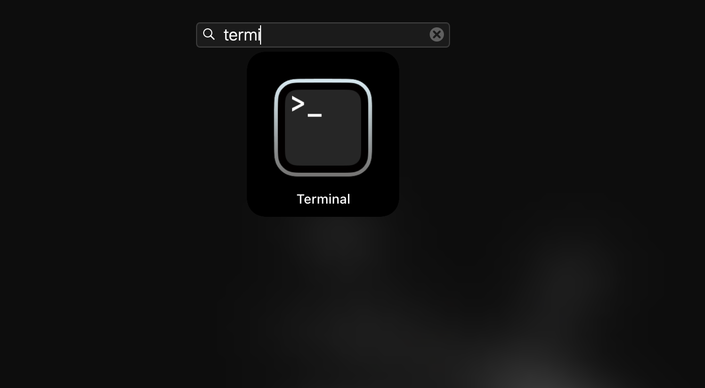
3. กดไอคอน Terminal

แบบเท่ ๆ

1. เปิด Spotlight search ด้วยปุ่ม `option` + `spacebar`
2. พิมพ์ `terminal`
   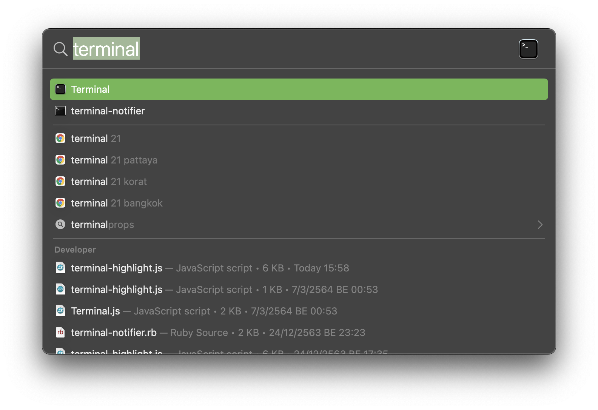
3. กด `enter` เสร็จ !

### เปิดโฟลเดอร์

ก็อปตรงนี้ไปเลย เป็นโค้ดสำหรับเปิดโฟลเดอร์ที่จะใช้ลง Mod

```
open ~/Library/Application\ Support/Steam/steamapps/common/Project\ Hospital/project_hospital.app/Contents/Resources/Data/StreamingAssets/Addons
```

จะได้แบบนี้

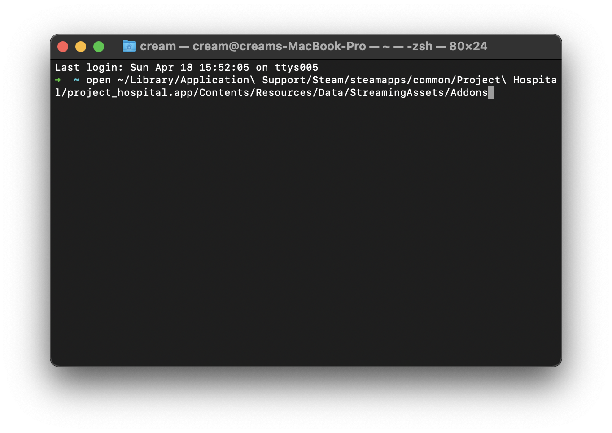

เสร็จแล้วกด enter คอมจะเปิดโฟลเดอร์มาให้เองแบบนี้

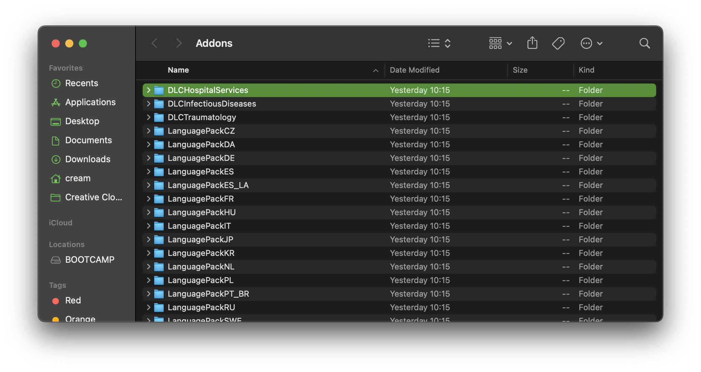

### ย้ายไฟล์

จากที่เราโหลดมา อย่างแรกที่ต้องย้ายเข้า คือไฟล์แปลไทยหลัก เป็นโฟลเดอร์ชื่อ "LanguagePackTH"

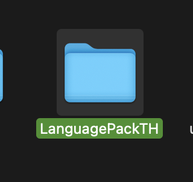

ให้ลากลงมาในโฟลเดอร์ Addons ที่เปิดอยู่

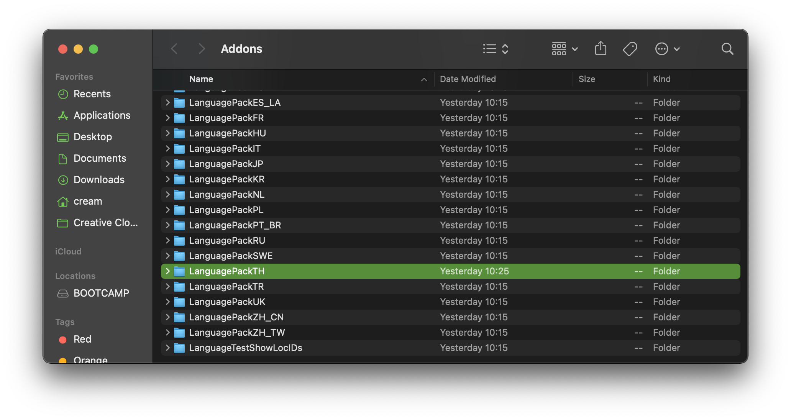

ต่อมาเป็นคำแปลเพิ่มเติม เข้าไปที่โฟลเดอร์ `DLCInfectiousDiseases`

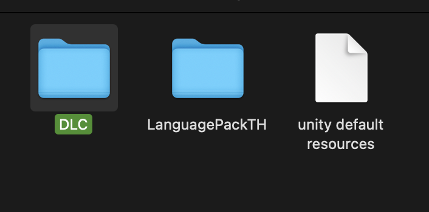

เข้าไปที่ `Database`

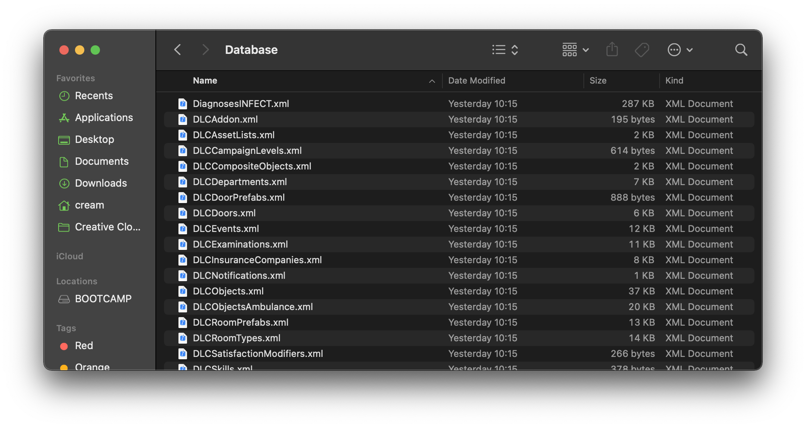

เปิดหน้านี้ค้างไว้

แล้วเปิดโฟลเดอร์ mod ที่โหลดมา

เข้าโฟลเดอร์ DLC


จะเจอไฟล์ชื่อ `StringTableThDLCInfectiousDiseases.xml`

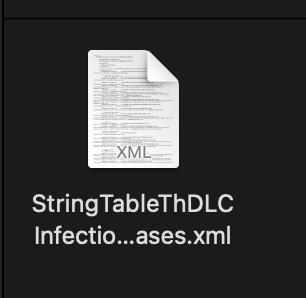

ลากเข้าไปในโฟลเดอร์ Database ที่เปิดไว้

ทีนี้ก็เรียบร้อย ! เปิดเกมส์ใหม่เล่นภาษาไทยได้เลย
