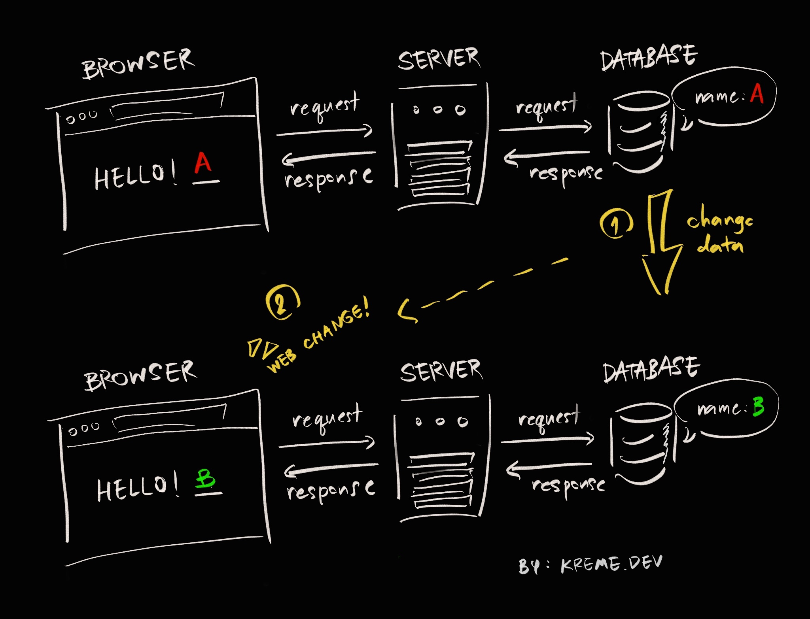
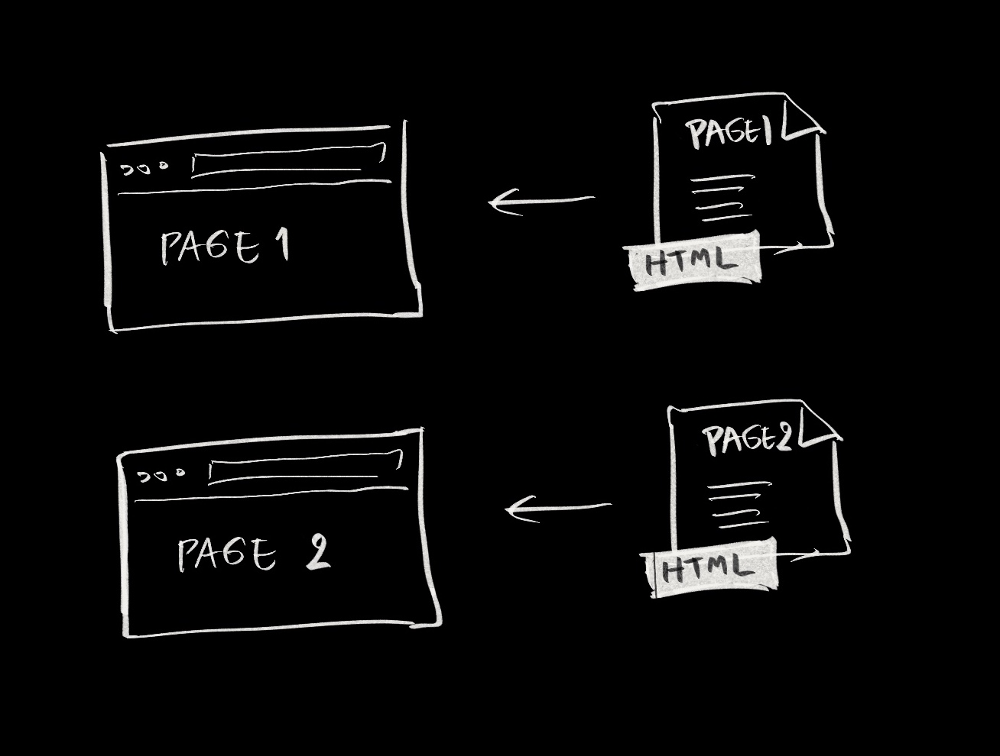
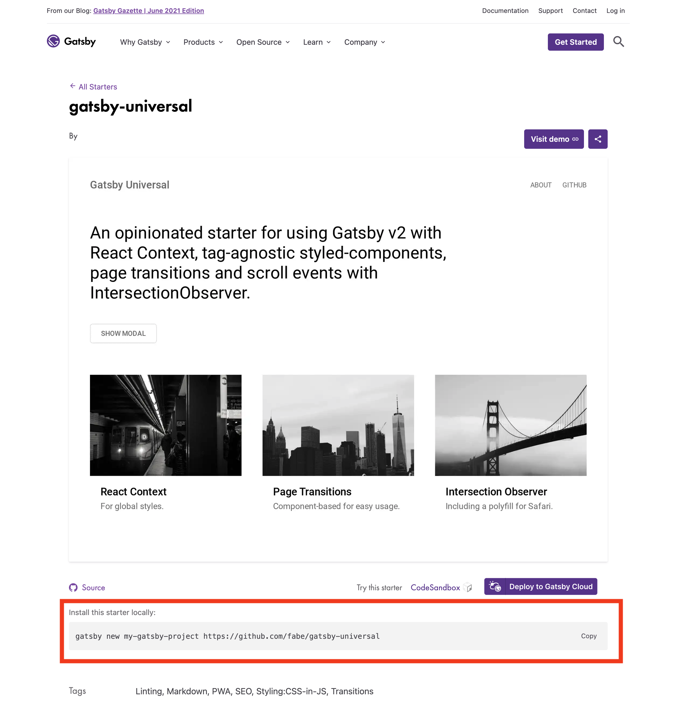

## TL; DR (Too long, don't read)

- I built static website
- I used [Gatsby](https://www.gatsbyjs.com/)
- I deployed on [Netlify](https://www.netlify.com/) (you can also use [Gatsby cloud](https://www.gatsbyjs.com/products/cloud/functions/), [firebase hosting](https://firebase.google.com/docs/hosting) or any other static site hosting services that provide generous free plan)
- all done!

---

#### Who should skip this blog?

- one who don't want to face any code, if you want a website like this you can [contact me on my facebook](https://www.facebook.com/qank1) or use Wix/Wordpress
- one who have built a [JAMstack](https://jamstack.org/what-is-jamstack/) site (you probably know everything in this blog already)

#### Who should read this blog?

- one who want to create a blog without hosting fee
- one who have fundamental knowledge of HTML, CSS, Javascript, command line (Know React and GraphQL is a big plus!)
- one who know how to use git (just `clone`, `add`, `commit` and `push` is fine)

(you can learn more abouut them in freeCodeCamp or check [this website](https://www.gatsbyjs.com/docs/tutorial/part-0/) out)

---

## Static website? What is it?

Websites can be separated into two different types: **static** and **dynamic**.

### Dynamic website

Most websites nowaday are dynamic websites. The data shown came from database, so when the data changed, the website changed.

For example, if I have a dynamic website that show name "A" from database.



Once I change the name in database to "B", the website changed accordingly

The most widely-used example is [Wordpress site](https://wordpress.org/) which is 65% of all content websites or 41.9% of all websites in the world!! (from [Usage statistics and market share of WordPress, W3techs](https://w3techs.com/technologies/details/cm-wordpress) June, 2021)

Wordpress is good choice for non-developer user. The themes I recommended are any theme from [Seedtheme](https://seedthemes.com/). It's very fast and SEO-friendly theme. (I had used it for a game website, my blog appeared on the first page in Google in 1 day without any coding!)

### Static website

Unlike dynamic website, the static website are just HTML files without database.

so it really FAST and more SECURE



### Why most websites are dynamic?

It's hard to maintain for a big website and not possible to implement some feature

it's very easier to maintain by anyone just change the data and all done.

---

### JAMstack, a modern way to build website (& apps)!

> Why pulled data from database, render in a template then process to HTML in every request? Should it be re-rendered only when the content changed?

THEN prebuild all the markup up front and serve it directly to the browser !


Learn more from the e-book: [Modern Web development in the JAMstack](https://www.netlify.com/pdf/oreilly-modern-web-development-on-the-jamstack.pdf)

There are many ways to use JAMstack e.g. Next.js, Nuxt.js and Gridsome. I choose Gatsby for my blog because

- I want to use React.js (lol)
- I love to store content in [Markdown](https://github.com/adam-p/markdown-here/wiki/Markdown-Cheatsheet) language so I can move my content easily from site to site (just copy files!)
- Many plugins available and they are FREE :)

---

### Start building

After installing development environment

The recommended way to build a Gatsby site is using [Gatsby Starters](https://www.gatsbyjs.com/starters)

Explore for the site you like and use it by cloning the code to your computer using gatsby command

For example,



if you want to use starter, you can name it as `my-blog-wow-fantastic` instead of `my-gatsby-project` or anything else without space or any special character

run this in terminal

```
gatsby new my-blog-wow-fantastic https://github.com/fabe/gatsby-universal
```

then go to the folder cloned

```
cd my-blog-wow-fantastic
```

then [push project's initial commit to a repository in Github](https://docs.github.com/en/github/importing-your-projects-to-github/importing-source-code-to-github/adding-an-existing-project-to-github-using-the-command-line)

install dependencies

```
yarn
```

then start developing with

```
gatsby develop

```

---

### Go LIVE

there are many alternatives for FREE static hosting

- [Github Pages](https://pages.github.com/)
- [Netlify](https://www.netlify.com/)
- [Vercel](https://vercel.com/docs)
- [Firebase Hosting](https://firebase.google.com/docs/hosting)

---

#### TIP:

- Wordpress is still a good choice for blogging in many situations. consider Pros and Cons before choosing
- you can build a wordpress website, export to a static site and deploy it for free :) just use a plugin like [WP2Static](https://wp2static.com/) or [Simply static](https://wordpress.org/plugins/simply-static/). (I haven't use it in my project but I think it's fine. [Shifter.io](https://www.getshifter.io/) also a great choice to have a look)
- you can easily manage static site content with [NetlifyCMS](https://www.netlifycms.org/), an open-source (free) CMS. It's work with any JAMStack site :)
- if you are a [Vue.js](https://vuejs.org/) fan, check out [Gridsome](https://gridsome.org/). It has the same idea as gatsby. I have used it before and love it.
- if you just want to make a document. [VuePress](https://vuepress.vuejs.org/) is a good choice too.

---

thanks for thumbnail image from [Jean-Marc Denis](http://jmd.im/black)!
